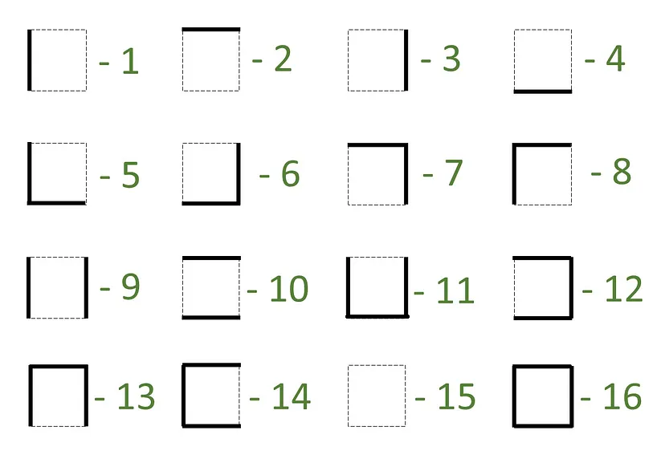
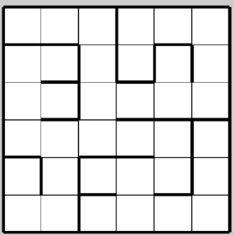

# Micromouse Induction (Software)

1. Read up and learn about micromouse and how the bot is to be designed.

2. Design any maze-solving algorithm of your choice (e.g., flood fill, wall follower, etc.) where the input is the configuration of a 6 cell x 6 cell maze. The start cell will be any one of the 4 corners, and the finishing cells are the center of the maze. You can use any programming language of your choice.

## Inputs

The image below shows the representation for the type of wall of a particular maze. The input maze will be given using this scheme.Use this to build your algorithm



For example, for this maze:



The input for the above maze would be:

```
sample_maze = [[14, 10, 7, 8, 10, 7],
               [8, 12, 9, 11, 13, 9],
               [1, 12, 1, 10, 4, 6],
               [5, 2, 4, 10, 7, 13],
               [13, 9, 14, 2, 6, 9],
               [5, 6, 14, 4, 10, 6]]

start = (0,0)
goal = (1,1)
```
The start location can be any corner of the maze, but for convenience, let it be ``(0,0)`` where the coordinate system is as follows: (row, column), for example, ``(1,3)`` corresponds to wall type ``11``.

The goal is usually the centre of the maze, but you need to make your algorithm in such a way that it can accept any goal coordinates

## Output

The output should be the path to be followed to reach the goal from the start.

For the above ``sample_maze`` the output would be:
```
[(0, 0), (0, 1), (0, 2), (1, 2), (2, 2), (3, 2), (3, 1), (3, 0), (2, 0), (1, 0), (1, 1)]
```